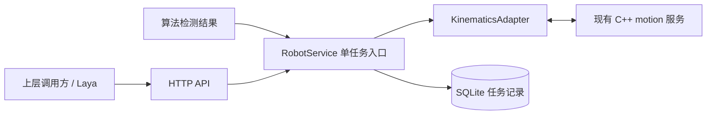

# 后端规划网关：第一阶段

## 范围与通信关系

提供统一 HTTP API、单任务规划入口、现有 C++ 运动学适配和 SQLite 任务记录。
机械臂控制柜、夹爪、力控和 Laya 展示尚未接入。



HTTP 默认监听 `127.0.0.1:8000`，内部 NDJSON TCP 默认监听 `127.0.0.1:9000`。
这些内部报文属于项目模块通信，不是机械臂控制柜协议。
前端和算法不能直接向 motion 转发指令，规划统一由 RobotService 下发。
TCP source 必须与会话注册身份一致；同名模块已有在线会话时拒绝第二条连接。
这属于本机模块身份约束，第一阶段未提供公网认证或授权服务。

## 请求与返回

四个业务接口：

| 方法与路径 | 用途 |
| --- | --- |
| `GET /health` | 后端是否已启动，不代表运动服务在线 |
| `GET /robot/status` | motion 在线、忙碌状态、当前任务与反馈来源 |
| `POST /robot/plan` | 提交世界坐标系 TCP 目标，返回 HTTP 202 与任务 ID |
| `GET /tasks/{task_id}` | 查询 SQLite 中的请求、状态、结果和错误 |

请求示例文件：`backend/config/examples/plan_request.json`，目标来自仓库场景的独立基准位姿。
请求结构如下；位置单位米，四元数顺序 `[qx,qy,qz,qw]`，关节角单位弧度：

```json
{
  "grasp_pose": {
    "position": [0.8, 0.0, 0.5],
    "orientation": [0.0, 0.0, 0.0, 1.0]
  },
  "force_limit": 5.0
}
```

上述结构示例不承诺可达，联调优先使用示例文件。
`current_joint_angles` 可选，传入时必须包含六个有限且在模型限位内的角度；
缺省使用 C++ 配置的 `initial_joint_angles`。四元数自动归一化，零范数拒绝。
`force_limit` 缺省 5 N，仅作为规划元数据，不执行夹持或力控。
拒绝额外字段、字符串或布尔伪装的数值、NaN/Infinity，以及未实现的 execute 开关。

HTTP 统一响应：

```json
{
  "code": 0,
  "msg": "success",
  "data": {
    "task_id": "后端生成的唯一任务标识",
    "status": "planning",
    "task_url": "/tasks/后端生成的唯一任务标识"
  },
  "timestamp": 1700000000000
}
```

任务状态为 `planning -> planned / failed / interrupted`。
`planned` 只表示求解和轨迹规划完成，结果包含关节目标、连续轨迹、时长和采样周期，
`executed=false`。不更新未经执行的当前角，也不推进分拣计数。
状态接口的 `current_joint_angles=null`、`feedback_source=unavailable`、
`controller_connected=false`；`planning_reference` 仅是初始规划参考角。

| HTTP 状态 | code | 含义 |
| --- | --- | --- |
| 202 | 0 | 已登记并开始后台规划 |
| 409 | 3003 | 已有规划任务，不排队、不抢占 |
| 422 | 1000 | 请求参数、参考限位或夹持力非法 |
| 503 | 4000 | motion 离线或网关正在关闭 |
| 404 | 1004 | 查询的任务不存在 |
| 500 | 3001 | 后端内部异常，详情写日志 |

规划提交后出现的错误记录在任务 `error`：1002 为等待结果超时，4000 为运动服务断线，
3001 为不可达、限位无解或结果校验失败。查询任务本身仍返回 HTTP 200，查看其终态和 error。

## 持久化与生命周期

SQLite 只保存一张 `robot_tasks` 表：任务 ID、状态、请求 JSON、结果 JSON、错误 JSON、
创建与更新时间（Unix 毫秒）。启动自动建表，不需要数据库服务或 ORM。
数据库路径相对仓库根目录解析，默认 `database/visrl_grasp.db`。
每次短操作独立连接，通过工作线程执行，避免数据库等待阻塞 TCP 心跳。
数据库、锁文件及日志不提交 Git。
后端日志写入配置的 `log_file`，默认 `logs/backend.log`，按 1 MiB 轮转并保留三份旧日志；
包含任务 ID、连接状态和错误，日志文件不写入 SQLite。

每个数据库只允许一个网关实例；使用操作系统文件锁，防止另一个进程误将活动任务标记中断。
启动入口固定一个 worker；关闭时保存运行任务的 interrupted 终态。
崩溃重启时把遗留 planning 记录标为 interrupted，保留历史，不自动重新下发。
断线或超时后释放规划占用，迟到响应按 task_id 丢弃，不改变已结束或后续任务。

正常入口通过 FastAPI lifespan 统一创建和关闭 TCP 监听、客户端、后台任务及实例锁。
旧的纯模拟分拣测试仍保留；实际网关收到算法检测结果时复用 RobotService，
仅规划第一个目标并向前端回传 planning_task_id、终态和 executed=false。

## 本机启动与验证

需要 Python 3.10+。仓库根目录执行：

```powershell
python -m venv .venv
./.venv/Scripts/python.exe -m pip install -r backend/main/requirements.txt
$env:VISRL_ENV = "sim"
./.venv/Scripts/python.exe -m backend.main.main
```

另一个终端启动已构建的 C++ 服务：

```powershell
./embedded/build/Release/motion_control.exe --config embedded/config/base.json
```

使用 Ninja 时程序位于构建目录根，而不是 Release 子目录；其他构建位置使用实际程序路径。
交互接口文档为 `http://127.0.0.1:8000/docs`。

第三个终端提交示例并查询：

```powershell
$task_body = Get-Content backend/config/examples/plan_request.json -Raw
$task_reply = Invoke-RestMethod -Method Post -Uri http://127.0.0.1:8000/robot/plan `
    -ContentType application/json -Body $task_body
Invoke-RestMethod -Uri "http://127.0.0.1:8000/tasks/$($task_reply.data.task_id)"
```

可重复查询任务直到状态不再是 planning。历史查询不要求 motion 在线。
停止并重启后端，再查询相同 ID 可验证持久化。

测试安装及运行：

```powershell
./.venv/Scripts/python.exe -m pip install -r tests/requirements.txt
$env:VISRL_MOTION_BINARY = "embedded/build/Release/motion_control.exe"
./.venv/Scripts/python.exe -m unittest discover -s tests/unit -v
./.venv/Scripts/python.exe -m unittest discover -s tests/integration -v
```

指定实际可运行的 C++ 程序路径，才能执行真实运动学联调；其余网关测试使用真实内部 TCP
模拟规划回复。`VISRL_ENV=real` 明确拒绝启动，第一阶段不向控制柜建立连接。
