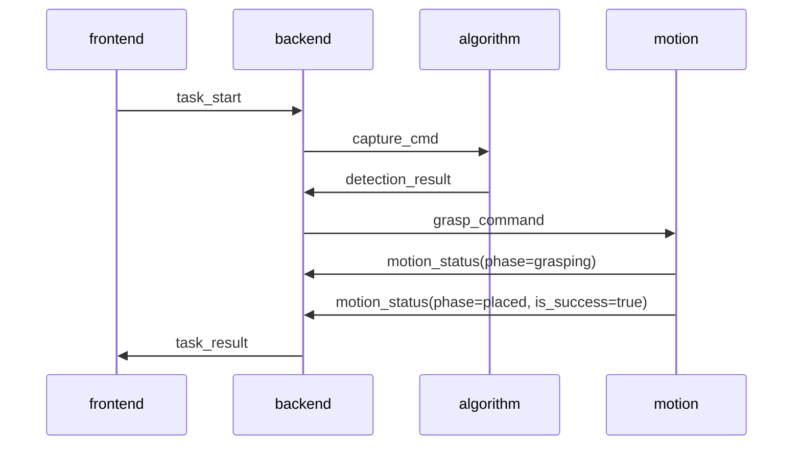

# TCP 通信协议规范

版本：V1.0 ｜ 遵循 [STYLEGUIDE](../STYLEGUIDE.md) 第 4 章 ｜ 本文档为全模块通信的唯一权威定义，修改须走接口变更流程（STYLEGUIDE 4.5）。

## 第 1 章 传输层约定

* 传输方式：TCP 长连接，后端调度服务作为唯一服务端，其余模块（算法、控制、前端网关）均为客户端。
* 报文分帧：**换行分隔 JSON（NDJSON）** —— 每条报文为一行 UTF-8 编码的 JSON 文本，以 `\n` 结尾；报文体内禁止出现裸换行符。
* 默认端口：`9000`（统一在各模块 `config/base.json` 中引用，禁止硬编码）。
* 超时与重试：请求超时 3 秒；单次请求最多重试 3 次，间隔 1 秒；断线重连间隔递增 1s/3s/5s（此后保持 5s）。
* 心跳保活：客户端每 3 秒发送一次 `heartbeat`，服务端 10 秒未收到心跳判定离线。

## 第 2 章 报文统一结构

```json
{
  "msg_type": "detection_result",
  "source": "algorithm",
  "target": "backend",
  "code": 0,
  "msg": "success",
  "data": {},
  "timestamp": 1700000000000
}
```

| 字段 | 类型 | 必填 | 说明 |
| ---- | ---- | ---- | ---- |
| msg_type | string | 是 | 报文类型，取值见第 3 章 |
| source | string | 是 | 发送方模块标识，取值见 3.1 |
| target | string | 是 | 接收方模块标识；`backend` 表示由调度服务自行消费 |
| code | int | 是 | 错误码，0 成功，非 0 异常，取值见第 4 章 |
| msg | string | 是 | 错误描述或状态说明 |
| data | object | 是 | 业务数据体，可为空对象 `{}` |
| timestamp | int | 是 | 发送端毫秒级时间戳 |

## 第 3 章 模块标识与报文类型

### 3.1 模块标识（source / target）

| 标识 | 模块 |
| ---- | ---- |
| backend | 后端调度服务 |
| algorithm | 智能算法服务（Python） |
| motion | 运动控制服务（C++） |
| frontend | 前端网关 |

### 3.2 报文类型（msg_type）

| msg_type | 方向 | data 关键字段 | 说明 |
| -------- | ---- | ------------- | ---- |
| register | 客户端 → backend | `module`（模块标识） | 连接建立后首条报文，完成身份注册 |
| register_ack | backend → 客户端 | - | 注册确认 |
| heartbeat | 客户端 → backend | - | 心跳保活 |
| heartbeat_ack | backend → 客户端 | - | 心跳应答 |
| task_start | frontend → backend | `task_id`、`category`、`speed_level` | 下发分拣任务 |
| capture_cmd | backend → algorithm | `task_id` | 图像采集与检测指令 |
| detection_result | algorithm → backend | `task_id`、`objects[]`（见 3.3） | 检测与位姿结果上报 |
| grasp_command | backend → motion | `task_id`、`grasp_pose`、`force_limit` | 抓取执行指令 |
| motion_status | motion → backend | `task_id`、`phase`、`is_success` | 运动执行状态回传 |
| task_result | backend → frontend | `task_id`、`sorted_count`、`is_finished` | 任务进度与结果推送 |
| error_report | 任意 → backend | `error_code`、`detail` | 异常主动上报 |

### 3.3 grasp_pose 与 objects 数据结构

坐标统一使用 **World Frame（世界基准坐标系）**，长度单位米，角度单位弧度。

```json
{
  "objects": [
    {
      "label": "apple",
      "confidence": 0.97,
      "grasp_pose": {
        "position": [0.35, -0.12, 0.08],
        "orientation": [0.0, 0.0, 0.0, 1.0]
      },
      "force_limit": 5.0
    }
  ]
}
```

* `position`：[x, y, z]
* `orientation`：四元数 [qx, qy, qz, qw]
* `force_limit`：夹爪最大夹持力（牛顿），由 RL 策略输出

## 第 4 章 全局错误码字典

错误码按模块分段（STYLEGUIDE 4.4），新增错误码必须在本表登记：

| 错误码 | 含义 |
| ------ | ---- |
| 0 | 成功 |
| 1000 | 通用：参数错误 |
| 1001 | 通用：报文格式错误（JSON 解析失败 / 缺少必填字段） |
| 1002 | 通用：请求超时 |
| 1003 | 通用：未注册的模块发送业务报文 |
| 2000 | 算法：模型加载失败 |
| 2001 | 算法：推理超时（已降级至几何默认策略） |
| 2002 | 算法：目标检测无结果 |
| 3000 | 硬件/仿真：仿真环境连接失败 |
| 3001 | 硬件/仿真：机械臂运动执行失败 |
| 3002 | 硬件/仿真：紧急停止已触发 |
| 4000 | 通信：目标模块离线 |
| 4001 | 通信：心跳超时判定断线 |

## 第 5 章 典型时序（单次分拣）


